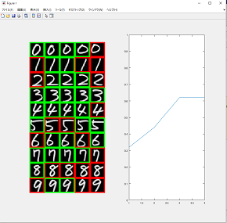
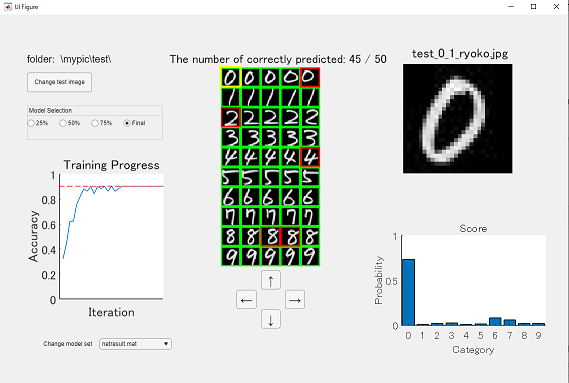

# Handwritten Digits Recognition


[](https://www.mathworks.com/matlabcentral/fileexchange/87814-teaching-ai-in-the-classroom)
[](https://matlab.mathworks.com/open/github/v1?repo=MathWorks-Teaching-Resources/teaching-ai-in-the-classroom-Introduction)

Copyright 2020 The MathWorks, Inc.


# Introduction


This sample code has been developed in collaboration with Kanazawa Institute of Technology on image classification using Convolutional Neural Networks. Using an original visualization app built with App Designer, students can visualize the training process of a neural network for improving its accuracy with their own handwritten letters while learning and experiencing practical techniques. 


  
# Workflow
## Step 1: Preparing your data
### Step1-1


[Instructor] Print the worksheet (template.pdf) and provide it to each student.


[Student] Write 0-9 digits on the printed worksheet as follows.


### Step1-2


[Instructor] Scan the worksheet written by each student and save it as a jpg image (In this example, we'll name it 1.jpg)


  
## Step2: Create training data from handwritten digit


Run the following code, then enter your name and hit "OK".


```matlab:Code
myimportnumber2_0
```


This code extracts each digit image from the worksheet and saves it in each folder as shown below.


  
### Step3: **Training and visualizing a model**


The code below trains a model while visualizing the training process.


```matlab:Code
myhandwrittentrain_visualization2_0
```





(Left figure) shows each test image. Each green box shows that the prediction is correct. Each red box shows that the prediction is wrong.


(Right figure) learning curve


In order for students to understand the training process, the code will save each model and learning curve as ‘netresult.mat’ at its accuracy reaching to 25%, 50%, 75% and training completion.


  
### Step4: App for analysis 

\hfill \break


```matlab:Code
myClassifierApp2_0
```


By running the code above, app pops up.





This app loads the test images and the saved networks.


In this GUI, you can change model to 25%,50%,75% accuracy and training completion at "Model Selection".


By changing model, you will notice how prediction changes


The image and score of a test image highlighted in yellow box is shown on the right-hand side.


The yellow box can be moved by clicking the bottom arrow icons.


  
### Step5: Train with other datasets


In the step2 to step4, each student tested with his or her own data. Let's use another data from another student and see what will happen.


Rename your dataset to mypic1


```matlab:Code
movefile mypic mypic1
```


Change code line 20 in myimportnumber2_0.m file to load another scanned worksheet. Then run the following code.


```matlab:Code
myimportnumber2_0
```


Load two sets of data from two students and create a folder called mypic2


```matlab:Code
myhandwrittentrain_for2sets2_0
```


The rest of the workflow is the same as step4. 


```matlab:Code
myClassifierApp2_0
```


You can also change test image in at “Change test image” and model sets at "Change model set".


# System Requirements


MathWorks Products 


   -  MATLAB 
   -  Deep Learning Toolbox 
   -  Image Processing Toolbox 
   -  Computer Vision Toolbox 

# Acknowledgement


We thank Dr. Shinichi Taniguchi, Prof. Akira Nakamura and Dr. Tomoshige Kudo for their valuable proposals and discussion that greatly improved this sample code. We would also like to show our gratitude to Kanazawa Institute of Technology for their agreement to publish this code.


